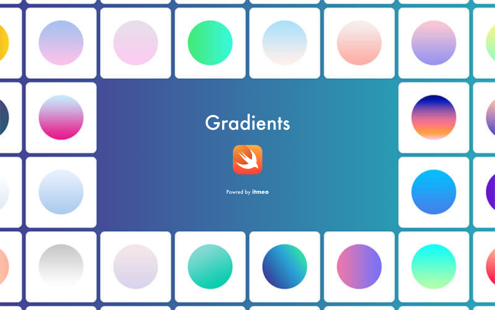
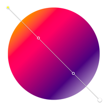

# Gradients

🌔 A curated collection of 180 splendid gradients made in swift



[](https://github.com/sindresorhus/awesome)

[](http://cocoapods.org/pods/Gradients)
[](http://cocoapods.org/pods/Gradients)
[](http://cocoapods.org/pods/Gradients)
[](https://github.com/Carthage/Carthage)

180 splendid Gradients inspired by [itmeo/webgradients](https://github.com/itmeo/webgradients)
[View all the gradients here »](https://webgradients.com)

## 🏄🏼 Easy To Use
```swift
view.layer.addSubLayer(Gradients.deepBlue.layer)
```

#### 180+ Gradients
```swift
public enum Gradients: Int, CaseIterable {
    case warmFlame = 1
    case nightFade
    case springWarmth
    case juicyPeach
    //...
    case fabledSunset
    case perfectBlue
}
```

#### Direction
```swift
public enum Direction {
    case top
    case left
    case right
    case bottom
    case degree(CGFloat)
}
```

## 🎨 Customize


```swift
// degree for radian direction supported
let customLayer = Gradients.linear(to: .degree(-225), colors: [0x231557, 0x44107A, 0xFF1361, 0xFFF800], locations: [0.0, 0.29, 0.67, 1.0]) // Fabled Sunset
view.layer.addSubLayer(customLayer)
```

## Examples
* [Comets](https://github.com/cruisediary/Comets): ☄️Comets: Animating Particles in Swift.
* [DeliTodo](https://github.com/kawoou/DeliTodo): Todo application for iOS using Deli.

## Requirements
Gradients is written in  Xcode 10, Swift 4+, iOS 9.0+ Required

## 📲 Installation
Gradients is available through [Cocoapods](http://cocoapods.org) or [Carthage](https://github.com/Carthage/Carthage)

### Cocoapods
```ruby
pod "Gradients"
```

### Carthage
```
github "cruisediary/Gradients" ~> 0.3.0
```

## ❤️ Contribution
Pull requests are always welcomed 🏄🏼

## Awesome
* [awesome-swift](https://github.com/matteocrippa/awesome-swift) - A collaborative list of awesome Swift libraries and resources. Feel free to contribute!
* [awesome-gradient](https://github.com/cruisediary/awesome-gradient) - 🌈 A curated list of awesome Gradient frameworks, libraries and software and resources

## 👨‍💻 Author
cruz, cruzdiary@gmail.com

## 🛡 License

Gradients is available under the MIT license. See the LICENSE file for more info.
